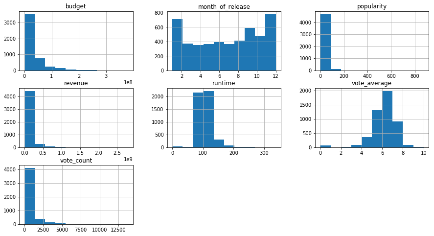
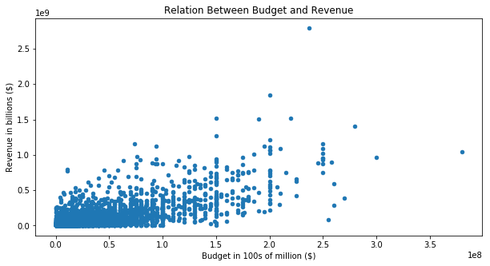
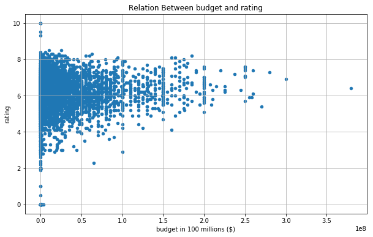
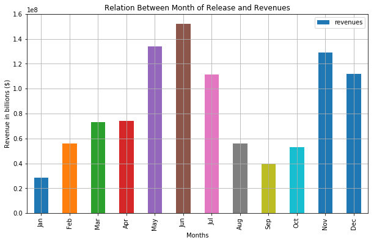
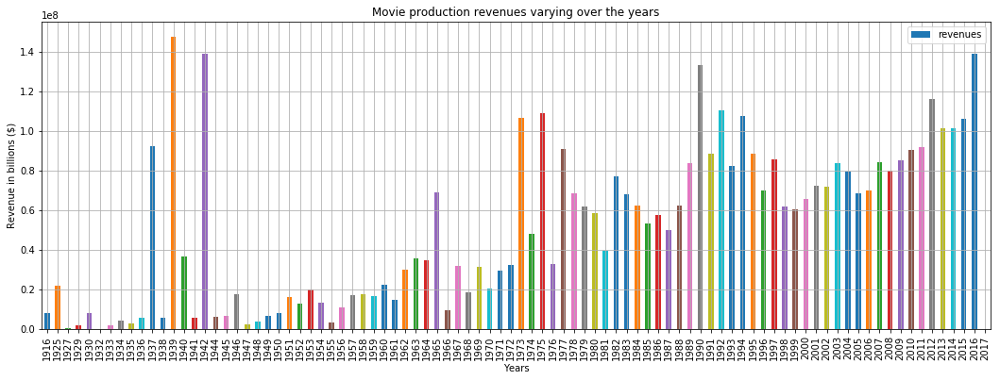

# Project: TMDB Movie Data Analysis

## Table of Contents
<ul>
<li><a href="#intro">Introduction</a></li>
<li><a href="#wrangling">Data Wrangling</a></li>
<li><a href="#eda">Exploratory Data Analysis</a></li>
<li><a href="#conclusions">Conclusions</a></li>
</ul>

<a id='intro'></a>
## Introduction

#### What can we say about the success of a movie before it is released? Are there certain companies (Pixar?) that have found a consistent formula? Given that major films costing over 100 million dollars to produce can still flop, this question is more important than ever to the industry. Film aficionados might have different interests. Can we predict which films will be highly rated, whether or not they are a commercial success?This data set contains information about 5000 movies collected from The Movie Database (TMDb), including user ratings and revenue. 


## The dataset has the following features:-

* budget - The budget in which the movie was made.
* genre - The genre of the movie, Action, Comedy ,Thriller etc.
* homepage - A link to the homepage of the movie.
* id - This is infact the movie_id as in the first dataset.
* keywords - The keywords or tags related to the movie.
* original_language - The language in which the movie was made.
* original_title - The title of the movie before translation or adaptation.
* overview - A brief description of the movie.
* popularity - A numeric quantity specifying the movie popularity.
* production_companies - The production house of the movie.
* production_countries - The country in which it was produced.
* release_date - The date on which it was released.
* revenue - The worldwide revenue generated by the movie.
* runtime - The running time of the movie in minutes.
* status - "Released" or "Rumored".
* tagline - Movie's tagline.
* title - Title of the movie.
* vote_average - average ratings the movie recieved.
* vote_count - the count of votes recieved.

### In this data analysis project we will answer the following questions
#### 1: Do higher budget movies always generate big revenues?
#### 2: Do higher budgets means higher ratings?
#### 3: Is the month of releasing a movie affects its revenues?
#### 4: How are movie production revenues trending over the years?

## So let's go!
#### Important note: Github dark theme makes the plot's text invisible so enable light theme for better view


### Importing libraries


```python
import pandas as pd
import numpy as np
import matplotlib.pyplot as plt
import seaborn as sns
%matplotlib inline
```

### Functions Definitions

#### a function for drawing a plot


```python
def plot_data(title, xlabel, ylabel, grid):
    plt.xlabel(xlabel)
    plt.ylabel(ylabel)
    plt.title(title)
    if(grid == True):
        plt.grid(True)
    plt.show()
```

<a id='wrangling'></a>
## Data Wrangling


### General Properties


```python
df = pd.read_csv('tmdb_5000_movies.csv')
df.head(3)
```


<div>
<style scoped>
    .dataframe tbody tr th:only-of-type {
        vertical-align: middle;
    }

    .dataframe tbody tr th {
        vertical-align: top;
    }

    .dataframe thead th {
        text-align: right;
    }
</style>
<table border="1" class="dataframe">
  <thead>
    <tr style="text-align: right;">
      <th></th>
      <th>budget</th>
      <th>genres</th>
      <th>homepage</th>
      <th>id</th>
      <th>keywords</th>
      <th>original_language</th>
      <th>original_title</th>
      <th>overview</th>
      <th>popularity</th>
      <th>production_companies</th>
      <th>production_countries</th>
      <th>release_date</th>
      <th>revenue</th>
      <th>runtime</th>
      <th>spoken_languages</th>
      <th>status</th>
      <th>tagline</th>
      <th>title</th>
      <th>vote_average</th>
      <th>vote_count</th>
    </tr>
  </thead>
  <tbody>
    <tr>
      <th>0</th>
      <td>237000000</td>
      <td>[{"id": 28, "name": "Action"}, {"id": 12, "nam...</td>
      <td>http://www.avatarmovie.com/</td>
      <td>19995</td>
      <td>[{"id": 1463, "name": "culture clash"}, {"id":...</td>
      <td>en</td>
      <td>Avatar</td>
      <td>In the 22nd century, a paraplegic Marine is di...</td>
      <td>150.437577</td>
      <td>[{"name": "Ingenious Film Partners", "id": 289...</td>
      <td>[{"iso_3166_1": "US", "name": "United States o...</td>
      <td>2009-12-10</td>
      <td>2787965087</td>
      <td>162.0</td>
      <td>[{"iso_639_1": "en", "name": "English"}, {"iso...</td>
      <td>Released</td>
      <td>Enter the World of Pandora.</td>
      <td>Avatar</td>
      <td>7.2</td>
      <td>11800</td>
    </tr>
    <tr>
      <th>1</th>
      <td>300000000</td>
      <td>[{"id": 12, "name": "Adventure"}, {"id": 14, "...</td>
      <td>http://disney.go.com/disneypictures/pirates/</td>
      <td>285</td>
      <td>[{"id": 270, "name": "ocean"}, {"id": 726, "na...</td>
      <td>en</td>
      <td>Pirates of the Caribbean: At World's End</td>
      <td>Captain Barbossa, long believed to be dead, ha...</td>
      <td>139.082615</td>
      <td>[{"name": "Walt Disney Pictures", "id": 2}, {"...</td>
      <td>[{"iso_3166_1": "US", "name": "United States o...</td>
      <td>2007-05-19</td>
      <td>961000000</td>
      <td>169.0</td>
      <td>[{"iso_639_1": "en", "name": "English"}]</td>
      <td>Released</td>
      <td>At the end of the world, the adventure begins.</td>
      <td>Pirates of the Caribbean: At World's End</td>
      <td>6.9</td>
      <td>4500</td>
    </tr>
    <tr>
      <th>2</th>
      <td>245000000</td>
      <td>[{"id": 28, "name": "Action"}, {"id": 12, "nam...</td>
      <td>http://www.sonypictures.com/movies/spectre/</td>
      <td>206647</td>
      <td>[{"id": 470, "name": "spy"}, {"id": 818, "name...</td>
      <td>en</td>
      <td>Spectre</td>
      <td>A cryptic message from Bond’s past sends him o...</td>
      <td>107.376788</td>
      <td>[{"name": "Columbia Pictures", "id": 5}, {"nam...</td>
      <td>[{"iso_3166_1": "GB", "name": "United Kingdom"...</td>
      <td>2015-10-26</td>
      <td>880674609</td>
      <td>148.0</td>
      <td>[{"iso_639_1": "fr", "name": "Fran\u00e7ais"},...</td>
      <td>Released</td>
      <td>A Plan No One Escapes</td>
      <td>Spectre</td>
      <td>6.3</td>
      <td>4466</td>
    </tr>
  </tbody>
</table>
</div>


```python
df.shape
```


    (4803, 20)


```python
df.info()
```

    <class 'pandas.core.frame.DataFrame'>
    RangeIndex: 4803 entries, 0 to 4802
    Data columns (total 20 columns):
    budget                  4803 non-null int64
    genres                  4803 non-null object
    homepage                1712 non-null object
    id                      4803 non-null int64
    keywords                4803 non-null object
    original_language       4803 non-null object
    original_title          4803 non-null object
    overview                4800 non-null object
    popularity              4803 non-null float64
    production_companies    4803 non-null object
    production_countries    4803 non-null object
    release_date            4802 non-null object
    revenue                 4803 non-null int64
    runtime                 4801 non-null float64
    spoken_languages        4803 non-null object
    status                  4803 non-null object
    tagline                 3959 non-null object
    title                   4803 non-null object
    vote_average            4803 non-null float64
    vote_count              4803 non-null int64
    dtypes: float64(3), int64(4), object(13)
    memory usage: 750.5+ KB


```python
df.describe()
```


<div>
<style scoped>
    .dataframe tbody tr th:only-of-type {
        vertical-align: middle;
    }

    .dataframe tbody tr th {
        vertical-align: top;
    }

    .dataframe thead th {
        text-align: right;
    }
</style>
<table border="1" class="dataframe">
  <thead>
    <tr style="text-align: right;">
      <th></th>
      <th>budget</th>
      <th>id</th>
      <th>popularity</th>
      <th>revenue</th>
      <th>runtime</th>
      <th>vote_average</th>
      <th>vote_count</th>
    </tr>
  </thead>
  <tbody>
    <tr>
      <th>count</th>
      <td>4.803000e+03</td>
      <td>4803.000000</td>
      <td>4803.000000</td>
      <td>4.803000e+03</td>
      <td>4801.000000</td>
      <td>4803.000000</td>
      <td>4803.000000</td>
    </tr>
    <tr>
      <th>mean</th>
      <td>2.904504e+07</td>
      <td>57165.484281</td>
      <td>21.492301</td>
      <td>8.226064e+07</td>
      <td>106.875859</td>
      <td>6.092172</td>
      <td>690.217989</td>
    </tr>
    <tr>
      <th>std</th>
      <td>4.072239e+07</td>
      <td>88694.614033</td>
      <td>31.816650</td>
      <td>1.628571e+08</td>
      <td>22.611935</td>
      <td>1.194612</td>
      <td>1234.585891</td>
    </tr>
    <tr>
      <th>min</th>
      <td>0.000000e+00</td>
      <td>5.000000</td>
      <td>0.000000</td>
      <td>0.000000e+00</td>
      <td>0.000000</td>
      <td>0.000000</td>
      <td>0.000000</td>
    </tr>
    <tr>
      <th>25%</th>
      <td>7.900000e+05</td>
      <td>9014.500000</td>
      <td>4.668070</td>
      <td>0.000000e+00</td>
      <td>94.000000</td>
      <td>5.600000</td>
      <td>54.000000</td>
    </tr>
    <tr>
      <th>50%</th>
      <td>1.500000e+07</td>
      <td>14629.000000</td>
      <td>12.921594</td>
      <td>1.917000e+07</td>
      <td>103.000000</td>
      <td>6.200000</td>
      <td>235.000000</td>
    </tr>
    <tr>
      <th>75%</th>
      <td>4.000000e+07</td>
      <td>58610.500000</td>
      <td>28.313505</td>
      <td>9.291719e+07</td>
      <td>118.000000</td>
      <td>6.800000</td>
      <td>737.000000</td>
    </tr>
    <tr>
      <th>max</th>
      <td>3.800000e+08</td>
      <td>459488.000000</td>
      <td>875.581305</td>
      <td>2.787965e+09</td>
      <td>338.000000</td>
      <td>10.000000</td>
      <td>13752.000000</td>
    </tr>
  </tbody>
</table>
</div>


## Data Cleaning

##### dropping unwanted columns


```python
df.drop(['id','homepage','overview','tagline','keywords','production_companies','production_countries','spoken_languages'], axis=1 , inplace=True)
```

##### converting release_date datatype from object to datetime64


```python
df = df.astype({"release_date":"datetime64[ns]"})
```

##### checking null values


```python
df[df.release_date.isnull()]
```


<div>
<style scoped>
    .dataframe tbody tr th:only-of-type {
        vertical-align: middle;
    }

    .dataframe tbody tr th {
        vertical-align: top;
    }

    .dataframe thead th {
        text-align: right;
    }
</style>
<table border="1" class="dataframe">
  <thead>
    <tr style="text-align: right;">
      <th></th>
      <th>budget</th>
      <th>genres</th>
      <th>original_language</th>
      <th>original_title</th>
      <th>popularity</th>
      <th>release_date</th>
      <th>revenue</th>
      <th>runtime</th>
      <th>status</th>
      <th>title</th>
      <th>vote_average</th>
      <th>vote_count</th>
    </tr>
  </thead>
  <tbody>
    <tr>
      <th>4553</th>
      <td>0</td>
      <td>[]</td>
      <td>en</td>
      <td>America Is Still the Place</td>
      <td>0.0</td>
      <td>NaT</td>
      <td>0</td>
      <td>0.0</td>
      <td>Released</td>
      <td>America Is Still the Place</td>
      <td>0.0</td>
      <td>0</td>
    </tr>
  </tbody>
</table>
</div>


```python
df[df.runtime.isnull()]
```


<div>
<style scoped>
    .dataframe tbody tr th:only-of-type {
        vertical-align: middle;
    }

    .dataframe tbody tr th {
        vertical-align: top;
    }

    .dataframe thead th {
        text-align: right;
    }
</style>
<table border="1" class="dataframe">
  <thead>
    <tr style="text-align: right;">
      <th></th>
      <th>budget</th>
      <th>genres</th>
      <th>original_language</th>
      <th>original_title</th>
      <th>popularity</th>
      <th>release_date</th>
      <th>revenue</th>
      <th>runtime</th>
      <th>status</th>
      <th>title</th>
      <th>vote_average</th>
      <th>vote_count</th>
    </tr>
  </thead>
  <tbody>
    <tr>
      <th>2656</th>
      <td>15000000</td>
      <td>[{"id": 18, "name": "Drama"}]</td>
      <td>it</td>
      <td>Chiamatemi Francesco - Il Papa della gente</td>
      <td>0.738646</td>
      <td>2015-12-03</td>
      <td>0</td>
      <td>NaN</td>
      <td>Released</td>
      <td>Chiamatemi Francesco - Il Papa della gente</td>
      <td>7.3</td>
      <td>12</td>
    </tr>
    <tr>
      <th>4140</th>
      <td>2</td>
      <td>[{"id": 99, "name": "Documentary"}]</td>
      <td>en</td>
      <td>To Be Frank, Sinatra at 100</td>
      <td>0.050625</td>
      <td>2015-12-12</td>
      <td>0</td>
      <td>NaN</td>
      <td>Released</td>
      <td>To Be Frank, Sinatra at 100</td>
      <td>0.0</td>
      <td>0</td>
    </tr>
  </tbody>
</table>
</div>


#### Dropping null values since their data aren't enough for analysis


```python
df.dropna(inplace = True)
```

#### Separating release date into year and month of release


```python
df['year_of_release'] = df['release_date'].dt.to_period("y")
df['month_of_release'] = df['release_date'].dt.month
```

#### After cleaning data this is what it look like


```python
df.head(3)
```


<div>
<style scoped>
    .dataframe tbody tr th:only-of-type {
        vertical-align: middle;
    }

    .dataframe tbody tr th {
        vertical-align: top;
    }

    .dataframe thead th {
        text-align: right;
    }
</style>
<table border="1" class="dataframe">
  <thead>
    <tr style="text-align: right;">
      <th></th>
      <th>budget</th>
      <th>genres</th>
      <th>original_language</th>
      <th>original_title</th>
      <th>popularity</th>
      <th>release_date</th>
      <th>revenue</th>
      <th>runtime</th>
      <th>status</th>
      <th>title</th>
      <th>vote_average</th>
      <th>vote_count</th>
      <th>year_of_release</th>
      <th>month_of_release</th>
    </tr>
  </thead>
  <tbody>
    <tr>
      <th>0</th>
      <td>237000000</td>
      <td>[{"id": 28, "name": "Action"}, {"id": 12, "nam...</td>
      <td>en</td>
      <td>Avatar</td>
      <td>150.437577</td>
      <td>2009-12-10</td>
      <td>2787965087</td>
      <td>162.0</td>
      <td>Released</td>
      <td>Avatar</td>
      <td>7.2</td>
      <td>11800</td>
      <td>2009</td>
      <td>12</td>
    </tr>
    <tr>
      <th>1</th>
      <td>300000000</td>
      <td>[{"id": 12, "name": "Adventure"}, {"id": 14, "...</td>
      <td>en</td>
      <td>Pirates of the Caribbean: At World's End</td>
      <td>139.082615</td>
      <td>2007-05-19</td>
      <td>961000000</td>
      <td>169.0</td>
      <td>Released</td>
      <td>Pirates of the Caribbean: At World's End</td>
      <td>6.9</td>
      <td>4500</td>
      <td>2007</td>
      <td>5</td>
    </tr>
    <tr>
      <th>2</th>
      <td>245000000</td>
      <td>[{"id": 28, "name": "Action"}, {"id": 12, "nam...</td>
      <td>en</td>
      <td>Spectre</td>
      <td>107.376788</td>
      <td>2015-10-26</td>
      <td>880674609</td>
      <td>148.0</td>
      <td>Released</td>
      <td>Spectre</td>
      <td>6.3</td>
      <td>4466</td>
      <td>2015</td>
      <td>10</td>
    </tr>
  </tbody>
</table>
</div>


```python
df.info()
```

    <class 'pandas.core.frame.DataFrame'>
    Int64Index: 4800 entries, 0 to 4802
    Data columns (total 14 columns):
    budget               4800 non-null int64
    genres               4800 non-null object
    original_language    4800 non-null object
    original_title       4800 non-null object
    popularity           4800 non-null float64
    release_date         4800 non-null datetime64[ns]
    revenue              4800 non-null int64
    runtime              4800 non-null float64
    status               4800 non-null object
    title                4800 non-null object
    vote_average         4800 non-null float64
    vote_count           4800 non-null int64
    year_of_release      4800 non-null object
    month_of_release     4800 non-null int64
    dtypes: datetime64[ns](1), float64(3), int64(4), object(6)
    memory usage: 562.5+ KB


```python
df.hist(figsize=(15,8));
```





<a id='eda'></a>
## Exploratory Data Analysis


### Research Question 1: Do higher budget movies always generate big revenues?


```python
df.plot(x='budget',y='revenue',kind='scatter',figsize=(10,5));
plot_data('Relation Between Budget and Revenue', 'Budget in 100s of million ($)', 'Revenue in billions ($)', False)
```





#### From the previous plot 
1: Do higher budget movies always generate big revenues?
> Ignoring the outliers, the answer to this question from the graph is No.

### Research Question 2: Do higher budgets means higher ratings?


```python
df.plot(x='budget',y='vote_average',kind='scatter',figsize=(10,6));
plot_data('Relation Between budget and rating', 'budget in 100 millions ($)', 'rating', True)
```





#### From the previous plot
2: Do higher budgets means higher ratings?
>  Not exactly, but as the budget increase the possibility of low rating decrease as we see when the budget is over 100 million dollars, most of the movies are above 6.


### Research Question 3: Is the month of releasing a movie affects its revenues?


```python
revenue_by_month = df.groupby('month_of_release')['revenue'].mean()
months=['Jan','Feb','Mar','Apr','May','Jun','Jul','Aug','Sep','Oct','Nov','Dec']
new_df = pd.DataFrame() #creating new dataframe that holds months names and the revenues average in that month

new_df['months'] = months
new_df['revenues'] = list(revenue_by_month)

new_df.plot(x='months',y='revenues',kind='bar',figsize=(10,6));\

plot_data('Relation Between Month of Release and Revenues', 'Months', 'Revenue in billions ($)', True)
```





#### Revenues average for each month


```python
new_df
```


<div>
<style scoped>
    .dataframe tbody tr th:only-of-type {
        vertical-align: middle;
    }

    .dataframe tbody tr th {
        vertical-align: top;
    }

    .dataframe thead th {
        text-align: right;
    }
</style>
<table border="1" class="dataframe">
  <thead>
    <tr style="text-align: right;">
      <th></th>
      <th>months</th>
      <th>revenues</th>
    </tr>
  </thead>
  <tbody>
    <tr>
      <th>0</th>
      <td>Jan</td>
      <td>2.863406e+07</td>
    </tr>
    <tr>
      <th>1</th>
      <td>Feb</td>
      <td>5.613842e+07</td>
    </tr>
    <tr>
      <th>2</th>
      <td>Mar</td>
      <td>7.310316e+07</td>
    </tr>
    <tr>
      <th>3</th>
      <td>Apr</td>
      <td>7.392762e+07</td>
    </tr>
    <tr>
      <th>4</th>
      <td>May</td>
      <td>1.339301e+08</td>
    </tr>
    <tr>
      <th>5</th>
      <td>Jun</td>
      <td>1.522845e+08</td>
    </tr>
    <tr>
      <th>6</th>
      <td>Jul</td>
      <td>1.115768e+08</td>
    </tr>
    <tr>
      <th>7</th>
      <td>Aug</td>
      <td>5.580475e+07</td>
    </tr>
    <tr>
      <th>8</th>
      <td>Sep</td>
      <td>3.999196e+07</td>
    </tr>
    <tr>
      <th>9</th>
      <td>Oct</td>
      <td>5.289629e+07</td>
    </tr>
    <tr>
      <th>10</th>
      <td>Nov</td>
      <td>1.288861e+08</td>
    </tr>
    <tr>
      <th>11</th>
      <td>Dec</td>
      <td>1.118489e+08</td>
    </tr>
  </tbody>
</table>
</div>


#### From the previous plot

3: Is there a relation between month of release and revenues?

yes, there are months that have higher probability to get higher revenues such as ( June, May , November , December and July ) respectivly.

### Research Question 4: How are movie production revenues trending over the years?


```python
revenue_by_year = df.groupby('year_of_release')['revenue'].mean()

df_years = pd.DataFrame() #Creatimg new dataframr that holds averege revenues for each year

df_years['revenues'] = list(revenue_by_year)
df_years['year'] = list(revenue_by_year.keys())

df_years.plot(x='year',y='revenues',kind='bar',figsize=(18,6));
plot_data('Movie production revenues varying over the years', 'Years', 'Revenue in billions ($)' ,True )
```





####  From the previous plot
4: How are movie production revenues trending over the years?
> Movie production rising over the years as we can see from the graph.


<a id='conclusions'></a>
## Conclusions

* ####  In movie production Higher budgets doesn't always mean that the movie will get high revenues or even to get high rating but as the budget increase the possibility of low rating decrease.
* ####  Releasing date of a movie will affect the success of that movie.
* ####  Movie production is rising over the years and the revenues increase in addition ofcourse to the budget of the movies

### Limitations

* #### There is no normalization or exchange rate or currency conversion is considered during this analysis and our analysis is limited to the numerical values of revenue.

* #### Dropping missing or Null values from variables of our interest might skew our analysis and could show unintentional bias towards the relationship being analyzed. etc.


```python
from subprocess import call
call(['python', '-m', 'nbconvert', 'Investigate_a_Dataset.ipynb'])
```


    0


